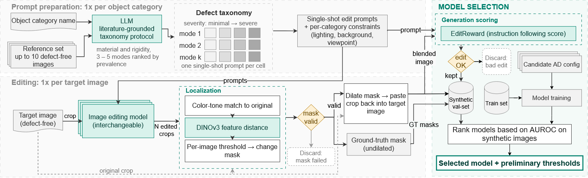
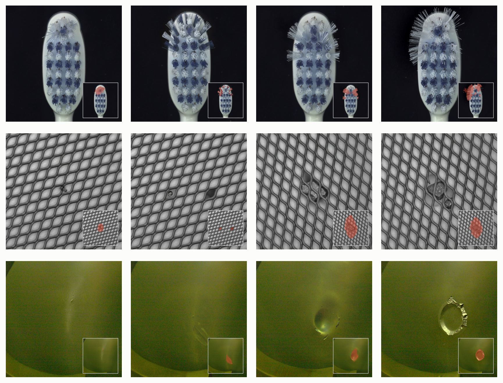

# synevad

Code for **VISUAL ANOMALY SYNTHESIS FOR MODEL SELECTION UNDER DATA SCARCITY**

Choosing a backbone, a resolution, and a coreset ratio for a new production line happens before any real defects exist to validate on. This repository generates severity-graded synthetic defects on the defect-free frames you do have, ranks candidate detectors on them, and measures the real-test score that choice gives up. That gap is **choice regret**: the real test score of the model the synthetic arm picked, against the real test score of the best model available.



*Prompt preparation once per category, a single-shot edit per target image, mask localization from the edit residual, then ranking of candidate anomaly detectors on the synthetic validation set.*



*Four severity grades, left to right, with the estimated defect mask inset.*

Two synthetic arms are scored over the same [PatchCore](https://github.com/amazon-science/patchcore-inspection) models. DINOv2/DINOv3 patch tokens are available through `synevad/backbones.py`.

| Arm | Defects from | Entry point |
|---|---|---|
| **FLUX** | FLUX.2 instruction edits, four severity grades per defect mode, masks from the edit residual | `scripts/generate_standalone_sweep.py` |
| **DRAEM** | Perlin noise × Describable-Textures overlays, frozen once | `scripts/generate_draem.py` |

## Install

```bash
uv sync
cp .env_template .env    # then edit: every path in it is yours
```

Python ≥ 3.12. Generation and sweeps need a CUDA GPU. Analysis is CPU-only and reads an MLflow store. `uv sync` pulls PatchCore and EditReward from git at pinned commits.

## Splits

A frame used to synthesize a defect stays out of the detector's training set. Both scripts write symlink trees.

```bash
# generation split: first N frames per category -> <cat>/source, the rest train
MVTEC_SRC=/path/to/MVTec bash scripts/make_split.sh

# pooled split both arms train on: a few frames per seed in train/good,
# every other frame free to carry a defect
python scripts/make_split_pools.py --sweep synevad/config/sweep_ablate_split.yaml
```

To replay an existing pooled split, pass `--pools <tree containing <cat>/train_pools.json>`.

## Smoke

```bash
MVTEC_SRC=/path/to/MVTec bash scripts/smoke_e2e.sh
```

Cuts both splits, generates 64 defects, fits 16 PatchCore models on two categories, runs the proxy analysis, and checks that a finite regret was produced. About ten minutes on one GPU. Output stays under `.smoke/`. `ARM=draem` runs the DRAEM arm. `--preflight` only validates the environment.

## How to use

A new dataset is one directory per object category, in the MVTec layout. `train/good` is the defect-free frames the method needs. `test/` and `ground_truth/` are optional, and are what the real arm scores regret against once defects exist.

```
mydata/
  widget/
    train/good/
    test/
    ground_truth/
```

**1. Keep generation frames out of training.** The first N defect-free frames become the edit sources; every other frame is what PatchCore fits on.

```bash
SRC=/path/to/mydata SPLIT_ROOT=$PWD/data/synevad/mydata N=10 bash scripts/make_split.sh
```

**2. Write one prompt file per category.** `prompts/mydata/widget.json` holds a `generation_prompts` list. Each entry is one independent edit of a defect-free frame: `mode`, `stage` (`minimal`, `slight`, `moderate`, or `severe`), and `prompt`. Copy `prompts/standalone/bottle.json` for the shape. Describe the lighting and viewpoint these frames actually have, and ask the editor to keep them.

**3. Generate.** Whole frames, about the size of MVTec, use the default config. `--dry-run` prints the job count before the model loads.

```bash
python scripts/generate_standalone_sweep.py \
    --config synevad/synthesis/configs/standalone_sweep.yaml \
    --sources-root data/synevad/mydata --source-subdir source \
    --prompts-dir prompts/mydata \
    --out-root data/bench/mydata \
    --categories widget --limit 2 --per-cell 1 --gpus 0
```

Frames of several thousand pixels on a side: start from `synevad/synthesis/configs/cropped_example.yaml` and set each window centre in a category-overrides file (`cropping.crop_centers`; see `category_overrides_cropped.yaml`). Each window is edited at native resolution, with its own prompts and masks.

**4. Rank detectors.** `synevad/config/mvtec.yaml` reads `MVTEC_PATH` (the split) and `SYNTHETIC_BENCH` (the corpus). A sweep file is the same shape as `synevad/config/sweep.yaml`, with `category: [widget]`.

```bash
export MVTEC_PATH=data/synevad/mydata
export SYNTHETIC_BENCH=data/bench/mydata

python -m synevad --config synevad/config/mvtec.yaml --sweep my_sweep.yaml --gpus 0
python scripts/analyze_proxy.py --version v1 --config synevad/config/mvtec.yaml \
    --select-by fixed image_auroc@all oracle
```

The synthetic arm ranks the grid from the defect-free frames alone. Regret, the real-test cost of that choice, needs the held-out `test/` set. Analysis lands in `outputs/analysis/<version>/`; the results table is `selected_summary.parquet`. A multi-GPU sweep needs `MLFLOW_TRACKING_URI` pointing at a tracking server.

## Licence

PatchCore is Apache-2.0 and is consumed as an upstream dependency.
